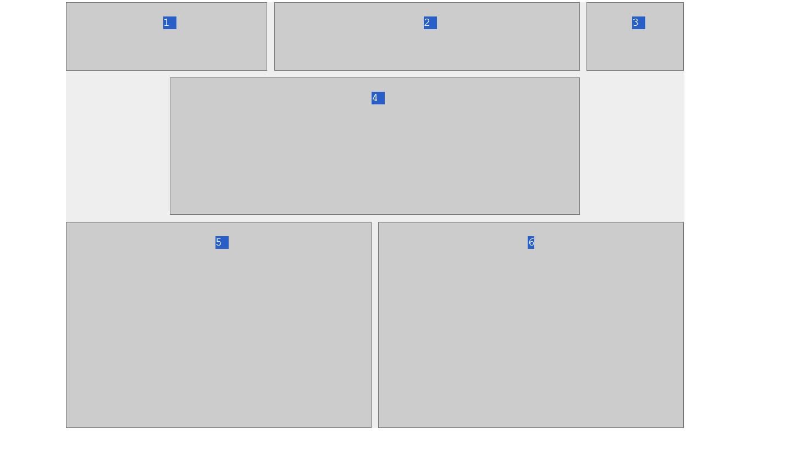

# simple-grid

# this project focus on specific grid css

# with display grid can make the selected class or id changed to grid

# to split each grade section equal vertically or through column
 grid-template-columns: repeat(6,1fr);\
# in the above example it split equally six position

# this one shows it holds  two portion of the above six
.grid-container > div:nth-child(1){
  grid-column: span 2;
}
two
# this one shows it holds   starting from 2 up to 6 not including one and six

.grid-container > div:nth-child(4){
  grid-column:2/6;
}

# see the out put picture

# Bisrat
# May-16-2024
